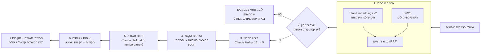
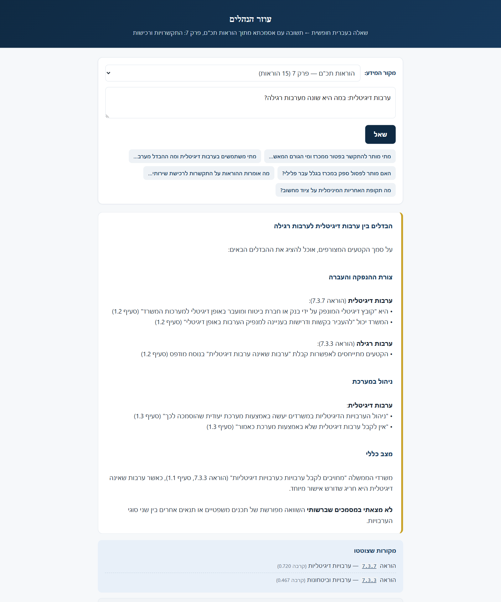

<div dir="rtl">

# עוזר הנהלים: תשובות עם אסמכתא מתוך הוראות התכ"ם

**מטלת בית למשרת מיישם/ת AI, אגף הטכנולוגיה, משרד האוצר** · אלעד סידיס · אוקטובר 2026

עובד/ת רכש שואל/ת שאלה בעברית חופשית ("מתי מותר להתקשר בלי מכרז, ומי צריך לאשר?"), ומקבל/ת תשובה מנוסחת שכל טענה בה מפנה להוראת תכ"ם ולסעיף. כשהתשובה לא נמצאת בהוראות, המערכת אומרת "לא מצאתי" במקום להמציא.

| | |
|---|---|
| 🎬 **סרטון הדגמה (3 דקות)** | קובץ MP4 מצורף להגשה: `otzar-takam-assistant-demo.mp4` |
| 📂 **הנתונים** | 15 הוראות מפרק 7 "התקשרויות ורכישות", כקבצי Word מקוריים: [`corpus/takam/`](corpus/takam/) |
| ▶️ **הרצה** | [איך מריצים](#איך-מריצים) (שתי פקודות, האינדקס כבר בנוי) |
| ✅ **בדיקת איכות** | [תרחישי הבדיקה והתוצאות](#בדיקת-איכות) · [איך הייתי מודד בייצור](#איך-הייתי-מעריך-באופן-שיטתי-בייצור) |
| 🔒 **סביבה מנותקת-רשת** | [חלק ג'](#חלק-ג-התאמה-לסביבה-ממשלתית-מנותקת-רשת-air-gapped) |

---

## חלק א': הבעיה והפתרון

### הבעיה: הידע קיים, אבל לא נגיש

פרק 7 בתכ"ם לבדו מכיל **61 הוראות בתוקף, כ-130 אלף מילים** (בערך 500 עמודי Word). ההוראות מתעדכנות: להוראה 7.1.1 יש כבר מהדורה 13, ולהוראה 7.3.3 מהדורה 17. עובד/ת רכש שצריכ/ה תשובה לשאלה מעשית נתקל/ת בשלושה מחסומים.

**1. החיפוש באתר לא קורא את ההוראות.** בדקתי את הקוד של האתר עצמו (הפונקציות `filterByFreeTxt` ו-`multiSearchAnd` בקובץ ה-JavaScript הראשי, 30.09.2026). החיפוש החופשי רץ בדפדפן על נתוני הקטלוג בלבד. הוא מפצל את השאילתה למילים, ומחזיר הוראה רק אם **שדה אחד** (כותרת, תיאור, תגיות או קוד) מכיל את **כל** המילים כמחרוזת. גוף ההוראה לא נסרק בכלל.

**2. לכן צריך לנחש את הניסוח הרשמי, מילה במילה.** ניסוי שהרצתי באתר ב-30.09.2026, ושוב ב-02.10.2026 עם אותן תוצאות (שלוש השורות הראשונות מצולמות בסרטון):

| מה חיפשתי | מה האתר החזיר | מה היה נכון |
|---|---|---|
| מתי מותר להתקשר בלי מכרז | **0 תוצאות** | 7.6.1 "פטור מחובת המכרז" |
| לקנות שירותי בינה מלאכותית | **0 תוצאות** | 7.10.7 "התקשרות לרכישת שירותי בינה מלאכותית" |
| ספק עם עבר פלילי | **0 תוצאות** | 7.3.4 "התחשבות במידע פלילי בהליכי רכש" |
| ערבות דיגיטלית | 1 תוצאה: 7.3.3 (הכללית) | 7.3.7 "ערבויות דיגיטליות", שלא הופיעה |
| ערבויות דיגיטליות (ברבים) | 1 תוצאה: 7.3.7 | ההבדל בין יחיד לרבים הוא ההבדל בין מציאה לפספוס |

**3. גם כשיש תוצאה, זה קובץ ולא תשובה.** האתר מחזיר קובץ Word להורדה. את הסעיף הרלוונטי, את הסכום ואת הגורם המאשר מחפשים בו ידנית. שאלה שנוגעת לשתי הוראות (למשל ערבות דיגיטלית מול ערבות רגילה) דורשת לפתוח שני קבצים ולהצליב.

התוצאה בפועל: חיפוש ידני במסמכים ארוכים, או פנייה לגורם מקצועי על כל שאלה. בתחום שבו טעות היא התקשרות לא תקינה, הפער הזה עולה בזמן ובסיכון.

### הפתרון: עוזר נהלים מבוסס RAG

**RAG (Retrieval-Augmented Generation)** פירושו שהמודל לא עונה מהזיכרון שלו. קודם המערכת **מאתרת** את הקטעים הרלוונטיים מתוך ההוראות, ורק אז מודל השפה **מנסח** תשובה מתוכם בלבד, עם הפניה לכל מקור.

תפקיד ה-AI מתחלק לשלוש נקודות, וכל אחת פותרת מחסום אחר מהרשימה למעלה:

| מחסום | מה ה-AI עושה | איך |
|---|---|---|
| חיפוש לפי מילים מדויקות | **חיפוש לפי משמעות**: "בלי מכרז" מגיע ל"פטור מחובת המכרז" | Embeddings (ייצוג מספרי של משמעות) עם Amazon Titan, לצד חיפוש מילים קלאסי (BM25) |
| תוצאות לא מדורגות | **דירוג מחדש**: 12 מועמדים עוברים דירוג לפי רלוונטיות לשאלה, ו-5 נשארים | Claude Haiku 4.5 כ-reranker |
| קובץ במקום תשובה | **ניסוח תשובה** שמשלבת כמה הוראות, עם מספר הוראה וסעיף לכל טענה | Claude Haiku 4.5, עם כללים מחייבים בפרומפט |

**למה RAG ולא גישה אחרת:**

| חלופה | למה לא |
|---|---|
| לשפר את החיפוש הקיים (מילים בלבד) | פותר חלקית את היחיד/רבים, לא את פער המשמעות ("בלי מכרז" ↔ "פטור"). ועדיין מחזיר קובץ ולא תשובה |
| לאמן (Fine-tune) מודל על ההוראות | ההוראות מתעדכנות כל הזמן, וכל עדכון היה מחייב אימון מחדש. מודל מאומן גם לא יודע להצביע על המקור, ואי אפשר לבדוק אותו |
| להדביק את כל ההוראות לפרומפט (Long context) | 130 אלף מילים בכל שאלה: יקר ואיטי, והדיוק יורד כשהמידע הרלוונטי "טובע" בטקסט ארוך |
| Bedrock Knowledge Bases (שירות RAG מנוהל) | אפשרי לייצור. ב-POC העדפתי שקיפות מלאה (רואים כל קטע וציון) ועלות idle אפס. במסלול המהיר, KB מקים OpenSearch Serverless שעולה מאות דולרים בחודש גם כשאף אחד לא שואל |

**שלושה עקרונות אמון, כי זו מערכת שעובדי ציבור יסתמכו עליה:**
1. **רק מתוך המקור.** הפרומפט אוסר ידע חיצוני, ואוסר להמציא סכומים, אחוזים, תאריכים או שמות ועדות שלא כתובים בקטעים ([`src/core/answer.ts`](src/core/answer.ts), `buildSystemPrompt`).
2. **כל טענה עם אסמכתא.** קופסת "מקורות שצוטטו" מציגה רק הוראות שהתשובה באמת נשענה עליהן, עם קישור להוראה באתר התכ"ם.
3. **"לא מצאתי" היא תשובה לגיטימית.** שאלה מחוץ להוראות מקבלת סירוב מפורש. זה חשוב יותר מלענות על עוד שאלה אחת.

והערה קבועה בממשק: המערכת עוזרת לאתר ולנסח. האסמכתא המחייבת היא ההוראה המקורית.

---

## חלק ב': ה-POC

### הנתונים: 15 הוראות מפרק 7

הורדתי את ההוראות ישירות מה-API של אתר התכ"ם (הקטלוג המלא בבקשה אחת, ואז כל הוראה כקובץ Word מקורי), ב-30.09.2026, בגרסה שבתוקף. בחרתי 15 הוראות מתוך 61 שיוצרות יחד את **מחזור החיים של התקשרות**: מבדיקת שוק, דרך מסמכי המכרז והערבויות, ועד פטור, הליך מקוצר, פרסום ומסלולים מיוחדים. הבחירה גם מכסה את המקרים הקשים לחיפוש הקיים.

| הוראה | כותרת | למה נבחרה |
|---|---|---|
| 7.0.1 | הגדרות בנושא התקשרויות ורכישות | מילון המונחים של הפרק |
| 7.1.1 | ועדות מכרזים וועדות פטור בממשלה | "מי מאשר": השאלה הנפוצה ביותר |
| 7.2.3 | פנייה מוקדמת לקבלת מידע (RFI) | תחילת התהליך |
| 7.3.1 | מסמכי מכרז | כולל נספח אבטחת מידע וסייבר, 51 אלף תווים |
| 7.3.3 | ערבויות וביטחונות | הכללית, מול הדיגיטלית |
| 7.3.4 | התחשבות במידע פלילי בהליכי רכש | 0 תוצאות בחיפוש "ספק עם עבר פלילי" |
| 7.3.7 | ערבויות דיגיטליות | לא נמצאת בחיפוש "ערבות דיגיטלית" |
| 7.4.1 | ניהול ההליך המכרזי | ההוראה המקיפה על ניהול מכרז |
| 7.6.1 | פטור מחובת המכרז | השאלה הקלאסית, עם טבלת מדרג אישורים |
| 7.7.1 | התקשרות בהליך מקוצר | ספים כספיים |
| 7.7.2 | מכרז סגור | ספים וסמכויות |
| 7.9.1 | פרסום מכרזים והתקשרויות | חובת פרסום |
| 7.10.3 | התקשרויות למתן שירותים חברתיים | מסלול ייעודי |
| 7.10.7 | התקשרות לרכישת שירותי בינה מלאכותית | AI שעונה על ההוראה שמסדירה רכש AI |
| 7.13.1 | כללים להקמת רשימת מציעים (מאגר) ולניהולה | מאגרי ספקים. ההוראה הארוכה בקורפוס (56 אלף תווים) |

הקבצים המקוריים נמצאים ב-[`corpus/takam/`](corpus/takam/), ולצידם `manifest-all.json` מהקטלוג הרשמי (כותרת, מהדורה, תאריך תוקף ותגיות לכל הוראה). בסך הכול כ-53 אלף מילים.

### הארכיטקטורה



**בליעה (Ingest):** חילוץ טקסט עברי מקובצי Word, כולל טבלאות ([`extract.ts`](src/core/extract.ts)) ← חיתוך לקטעים של כ-900 תווים עם חפיפה של 180, לפי גבולות פסקה ([`chunk.ts`](src/core/chunk.ts)) ← הטמעה ב-Titan Text Embeddings v2 (1024 ממדים) ← אינדקס בקובץ JSON ([`store.ts`](src/core/store.ts)). בליעת 15 ההוראות הפיקה 923 קטעים, ארכה 2.2 דקות ועלתה כ-1 סנט (0.0101$, כ-504 אלף טוקנים).

**שאילתה:** [`retrieve.ts`](src/core/retrieve.ts) ← [`rerank.ts`](src/core/rerank.ts) ← [`answer.ts`](src/core/answer.ts). כל הלוגיקה יושבת ב-[`src/core/`](src/core/). השרת המקומי ([`src/local/server.ts`](src/local/server.ts)) ופונקציות ה-Lambda ([`src/lambda/`](src/lambda/)) הן עטיפות דקות סביב אותו קוד, כך שאותה מערכת רצה גם מקומית וגם כ-serverless על AWS (S3 event ← Lambda בליעה; Lambda שאילתה).

### הבחירות הטכניות המרכזיות, ולמה

**1. חיפוש היברידי (משמעות + מילים), לא רק וקטורי.** ההוראות מלאות במספרים, בקודים ובמונחים מדויקים ("תקנה 3(29)", "300,000 ₪"). חיפוש לפי משמעות מפספס אותם, וחיפוש לפי מילים מפספס ניסוח יומיומי. שני הדירוגים ממוזגים ב-[Reciprocal Rank Fusion](https://plg.uwaterloo.ca/~gvcormac/cormacksigir09-rrf.pdf), שממזג לפי מיקום ולא לפי ציון, כי ציונים של שני מנועים שונים לא ברי-השוואה.

**2. Titan Text Embeddings v2 ולא Cohere. נמדד, לא הונח.** השוויתי את הפער בין קטע רלוונטי ללא-רלוונטי בעברית, וככל שהוא גדול יותר, המערכת מבחינה טוב יותר. Cohere multilingual v3 נתן 0.111, Cohere v4 נתן 0.289, ו-**Titan v2 נתן 0.393, בחמישית מהמחיר**. ([תיעוד Titan](https://docs.aws.amazon.com/bedrock/latest/userguide/titan-embedding-models.html))

**3. דירוג מחדש (Reranker).** חיפוש וקטורי מוצא את ההוראה הנכונה *בין* 12 המועמדים הראשונים כמעט תמיד, אבל לא תמיד *ראשונה*. בשלב הזה Claude Haiku מדרג את 12 המועמדים לפי השאלה. יחד עם איחוד החיפוש, השיעור של "ההוראה הנכונה ראשונה" עלה מ-45% ל-74% על 76 שאלות. במדידה מזווגת של הדירוג לבדו, על 40 שאלות, top-1 עלה מ-25 ל-32. העלות היא כ-0.4 סנט לשאלה.

**4. ההוראה השלמה, לא רק הקטע.** תשובה על ספים ואישורים דורשת את התנאים והחריגים שמסביב. לכן הקטעים שנבחרו מורחבים להוראה המלאה (עד 24 אלף תווים) או לסביבת הקטע. זה הפתרון לתשובות "נכונות אבל חסרות".

**5. שתי שכבות סירוב.** שכבה דטרמיניסטית: אם אף קטע לא דומה מספיק לשאלה (ציון קוסינוס מתחת ל-0.30), המערכת מסרבת **בלי לקרוא למודל בכלל**, כלומר בעלות אפס. שכבת פרומפט: אם יש קטעים דומים אבל הם לא עונים, המודל מחויב לומר "לא מצאתי במסמכים שברשותי". הסירוב נשמר בשדה מובנה (`refused`), וקופסת המקורות מתרוקנת כשיש סירוב.

**6. מאגר וקטורים כקובץ, לא כשירות.** ל-15 הוראות, סריקה לינארית על כמה מאות וקטורים לוקחת מילישניות. שירות מנוהל (OpenSearch Serverless) היה עולה 175–350$ בחודש גם כשאף אחד לא שואל. מסלול הייצור המתועד הוא [Amazon S3 Vectors](https://docs.aws.amazon.com/AmazonS3/latest/userguide/s3-vectors.html), בלי לשנות את ה-API הפנימי.

**7. שכבת transport אחת לכל קריאת מודל.** אף קובץ מלבד [`embed.ts`](src/core/embed.ts) ו-[`answer.ts`](src/core/answer.ts) לא מדבר עם ספק מודלים. החלפת ספק (Bedrock, API ישיר של Anthropic, או בעתיד מודל מקומי) היא שינוי במקום אחד. זה מה שהופך את חלק ג' לאפשרי.

**8. Claude Haiku 4.5 דרך AWS Bedrock.** מספיק חזק לעברית משפטית ולציות לכללי ציטוט, מהיר (בלי חניקת מכסה, המילה הראשונה מגיעה אחרי 2–4 שניות), וזול: 2–5 סנט לשאלה כולל הדירוג. Bedrock גם שומר את הנתונים בחשבון הארגוני ([תיעוד Claude ב-Bedrock](https://docs.aws.amazon.com/bedrock/latest/userguide/model-parameters-anthropic-claude-messages.html)).

**9. שקיפות מובנית.** כל תשובה מציגה את "מה המערכת קראה" (כל הקטעים שנשקלו וציון הדמיון שלהם), איזה מודל ענה, מתי האינדקס נבנה וכמה עלתה השאלה. כך המשתמש יכול לבדוק, והמפתח יכול לאבחן.

### הממשק

דף עברי אחד ([`public/index.html`](public/index.html)), RTL מלא, בלי build: תיבת שאלה, כפתורי שאלות לדוגמה, תשובה בהזרמה (streaming), קופסת "מקורות שצוטטו" עם קישורים לאתר התכ"ם, קופסה מתקפלת "מה המערכת קראה", ושורת מודל ועלות.



### איך מריצים

**דרישות:** Node.js 22 ומעלה, ו-credentials של AWS עם גישה ב-Bedrock למודלים `amazon.titan-embed-text-v2:0` ו-Claude Haiku 4.5 (inference profile ‏`us.anthropic.claude-haiku-4-5-20251001-v1:0`), ב-`us-east-1`.

```bash
npm install
cp .env.example .env   # ולמלא את שלושת ערכי ה-AWS
npm run serve          # ואז לפתוח http://localhost:5173
```

האינדקס של 15 ההוראות כבר בנוי ([`data/takam.json`](data/)), כך שאין צורך בשלב הבליעה. פקודות נוספות:

```bash
npm run ask -- "מתי מותר להתקשר בלי מכרז?"   # שאלה מהטרמינל
npm run retrieve -- "ערבות דיגיטלית"          # רק האחזור, בלי מודל: מה נמצא ובאיזה ציון
npm run ingest                                 # בנייה מחדש של האינדקס (כמה סנטים)
npm run eval                                   # הרצת תרחישי הבדיקה (כ-1$ וכ-8 דקות)
npm run typecheck
```

**עלויות:** 2–5 סנט לשאלה (נמדד), וסירוב בשער הביטחון עולה 0. אין משאב ענן שעולה כסף כשלא שואלים. כל ההשלמה של המטלה ב-AWS (בליעה, שתי ריצות בדיקה, שאלות ההדגמה וצילום הסרטון) עלתה כ-2$. אפשר גם להפנות את ניסוח התשובות ל-API הישיר של Anthropic (`LLM_ROUTE=anthropic` ו-`ANTHROPIC_API_KEY`), אבל חיפוש המשמעות עדיין צריך את Titan ב-Bedrock.

---

## בדיקת איכות

### תרחישי הבדיקה

בניתי סט של **22 שאלות עם תשובה ידועה** ו-**14 שאלות בקרה** שחייבות לקבל "לא מצאתי". הקבצים: [`eval/scenarios.json`](eval/scenarios.json) ו-[`eval/controls.json`](eval/controls.json).

**איך נבנו שאלות הזהב:** כל שאלה מנוסחת כמו שעובד/ת היה שואל/ת, ולעולם לא כוללת את מספר ההוראה. לכל שאלה יש `fact` קצר (סכום, מספר ימים, גורם מאשר) **שנבדק אוטומטית שמופיע מילה במילה** בטקסט ההוראה הנכונה, וב-15 ההוראות הוא מופיע רק בה. כך "התשובה הנכונה" היא עובדה בדוקה ולא פרשנות. הסט מכסה חמישה סוגי שאלות (מספרי, כן/לא, מי מאשר, תהליך, איפה כתוב), ושלוש שאלות בו דורשות שילוב של שתי הוראות.

**איך נבנו שאלות הבקרה:** 7 הן שאלות "כמעט" מאותו עולם תוכן, שהתשובה עליהן נמצאת בהוראות אחרות של פרק 7 **שלא נכללו** במדגם. למשל מכירת ציוד ישן (7.14.1): בקורפוס יש ספים דומים לרכישה, והפיתוי "להשלים" גבוה. 7 הן שאלות של עובד מדינה מחוץ לתחום (ימי חופשה, אש"ל, רכב צמוד). שאלת בקרה נחשבת עוברת רק אם המערכת סירבה.

**איך נשפט:** התאמה מילולית של ה-`fact` בתשובה, ואם אין התאמה (כי התשובה ניסחה אחרת), שופט LLM מקבל את השאלה, העובדה והתשובה ומכריע. בנוסף נמדד אם ההוראה הנכונה נמצאה ובאיזה מקום ([`src/eval/run-eval.ts`](src/eval/run-eval.ts), [`src/eval/judge.ts`](src/eval/judge.ts)).

### התוצאות

ריצה תקפה מ-02.10.2026, מקביליות 1: 36 מתוך 36 שאלות נענו, אפס כישלונות. הקובץ המלא, כולל כל תשובה, הציון שלה והתצורה שרצה: [`eval/results/2026-10-02T06-33-18.json`](eval/results/2026-10-02T06-33-18.json).

| מדד | תוצאה |
|---|---|
| **דיוק תשובה** (העובדה הנכונה מופיעה, וההוראה הנכונה מצוטטת) | **16/22 (72.7%)** |
| ההוראה הנכונה בין 12 המועמדים (recall@12) | 22/22 (100%) |
| ההוראה הנכונה ראשונה / בין 3 הראשונות, אחרי דירוג | 19/22 (86.4%) / 21/22 (95.5%) |
| **סירוב נכון בשאלות בקרה** | **14/14 (100%)**, אפס תשובות מומצאות |
| זמן עד המילה הראשונה, p50 / p90 | 5.6 / 9.1 שניות. רוב הפער הוא המתנה לחניקה של מכסת Bedrock בחשבון חדש. בניכוי ההמתנה והקריאות שנדחו: 2.1 / 4.2 שניות |
| עלות | 0.71$ לכל הריצה, כ-2 סנט לשאלה בממוצע (סירוב בשער הביטחון עולה 0) |

| סוג שאלה | נכון |
|---|---|
| מספרי (סכום, אחוז, ימים) | 8/9 |
| מי מאשר | 3/3 |
| איפה כתוב | 1/1 |
| תהליך | 1/2 |
| כן/לא (שאלה שדורשת להחיל כלל על מקרה) | 3/7 |

**מה נכשל ולמה.** קראתי כל אחת מ-6 השגיאות, כי אותו מספר יכול להסתיר מנגנונים שונים מאוד:

| שאלה | מה קרה | המנגנון |
|---|---|---|
| s-09: בפטור ממכרז, מותר לבקש מהמשטרה לבדוק עבר פלילי של ספק? | התשובה ציטטה את הסעיף שעונה בדיוק ("לא תהיה מוסמכת... בהתקשרות בפטור ממכרז"), ובכל זאת נפתחה ב"לא מצאתי" | סירוב-יתר. החמורה ברשימה, כי התשובה הייתה מולה |
| s-01: מתי מוצר נחשב "כחול-לבן"? | מצאה וציטטה את העובדה (35% לפחות ממחיר ההצעה), אבל פתחה ב"לא מצאתי", כי בהוראה המונח הוא "טובין מתוצרת הארץ" | סירוב-יתר על פער מינוח |
| s-04: אפשר להאריך פיילוט שרץ במסגרת RFI? | נעצרה בשער הביטחון בלי לקרוא למודל. ההוראה הנכונה (7.2.3) הייתה ראשונה, אבל ציון הדמיון היה מתחת לסף 0.30 | סף זהיר מדי לשאלה הזו |
| s-03: פטור דחוף: מתי מותר לחתום אחרי פרסום ההחלטה? | הקטע עם "תיכנס לתוקף מיד עם פרסומה" לא הגיע למודל. התשובה אמרה בכנות שלא מצאה מספר ימים | פספוס אחזור (ההוראה הנכונה דורגה שנייה) |
| s-15: ספק ותיק שמכיר את המערכת, זה מספיק לספק יחיד? | התשובה נכונה בכיוון ("לא, זה לא מספיק"), אבל בלי הקביעה המפורשת בהוראה ("לא ייחשבו בפני עצמם"), והשופט פסל | גבולי: תשובה נכונה בלי האסמכתא המדויקת |
| s-18: רכישה של 60 אלף ₪ בלי מכרז, צריך לפרסם? | בלבול בין הליך מקוצר לתקנות הפטור, ותשובה שסותרת את עצמה | שגיאת הסקה אמיתית |

**המסקנה.** כיוון הטעות חשוב לא פחות מהשיעור שלה. 3 מתוך 6 השגיאות הן סירוב-יתר, ובשאלות הבקרה אין אף תשובה מומצאת. זו בחירה מכוונת לטובת זהירות במערכת שעובדי ציבור יסתמכו עליה. החולשה המרוכזת היא שאלות כן/לא, שבהן צריך להחיל כלל על מקרה ולא רק לשלוף עובדה. המנוף הבא הוא שלב הניסוח, לא החיפוש: ההוראה הנכונה נמצאה בין המועמדים ב-22 מתוך 22. בקוד קיים ניסוי כבוי (`REFUSAL_QUOTE_CHECK`) שבודק אם סירוב שציטט עובדה בעצם עונה. לא הפעלתי אותו להגשה, כי לא מדדתי אותו על הסט הזה.

**הסרגל בודק גם את עצמו.** ריצה קודמת באותו בוקר נתנה בדיוק אותן תוצאות (אותן 6 שאלות שגויות), אבל הכריזה על עצמה פסולה: כלל שנבנה כדי לתפוס שלב דירוג שלא רץ בשקט ספר את s-04, שנעצרה בכוונה בשער הביטחון, כ"שלב שלא רץ". תיקנתי את הכלל כך ששורה שנעצרה בשער לא נספרת כתקלה, אבל נשארת שגויה בדיוק. הקובץ הפסול נשאר ב-[`eval/results/`](eval/results/) לצד התקף.

### תרחישי ההדגמה (מהסרטון)

ארבע השאלות שבסרטון, כפי שנמדדו ב-02.10.2026 ([`eval/demo-questions-2026-10-02.json`](eval/demo-questions-2026-10-02.json)):

| # | שאלה | מה המערכת עשתה | מקורות שצוטטו | מילה ראשונה | עלות |
|---|---|---|---|---|---|
| 1 | מתי מותר להתקשר בלי מכרז, ומי צריך לאשר? | תשובה מלאה ממדרג האישורים, עם סכומים וגורם מאשר לכל תקנה. באתר: 0 תוצאות | 7.6.1 | 3.3 שנ' | 4.2 סנט |
| 2 | אנחנו רוצים לקנות שירותי בינה מלאכותית. מה צריך לדעת? | ההוראה הייעודית, עם התנאים, המגבלות והאישורים. באתר: 0 תוצאות | 7.10.7 | 2.0 שנ' | 2.6 סנט |
| 3 | ערבות דיגיטלית: במה היא שונה מערבות רגילה? | תשובה אחת משתי הוראות | 7.3.7, 7.3.3 | 1.9 שנ' | 2.4 סנט |
| 4 | המשרד רוצה למכור מחשבים ישנים. עד איזה סכום אפשר למכור בלי מכרז? | "לא מצאתי". מכירת ציוד מוסדרת ב-7.14.1, שלא נכללה במדגם. כאן הסירוב הגיע משכבת הפרומפט: היו קטעים דומים על רכישה, והמודל זיהה שהם לא עונים | — | 2.3 שנ' | 2.9 סנט |

### איך הייתי מעריך באופן שיטתי בייצור

את הסרגל הזה כבר בניתי והרצתי על המערכת המלאה (ראו [נספח](#נספח-מעבר-למטלה-אותה-מערכת-על-כל-411-הוראות-התכם)). בייצור הייתי מרחיב אותו בחמישה כיוונים:

**1. סט זהב גדול ומתוחזק.** מאות שאלות אמיתיות מעובדי רכש (לא רק שאלות שנוצרו מהמסמכים), עם תשובה שאושרה על ידי גורם מקצועי באגף, ו-100+ שאלות בקרה. הסט מתעדכן כשהוראה משתנה: שאלה שהתשובה עליה השתנתה בהוראה חדשה היא בדיוק המקרה שחייבים לתפוס.

**2. מדדים נפרדים לכל שלב, כדי לדעת מה לתקן.** אחזור (האם ההוראה הנכונה בין 12 המועמדים, ובאיזה מקום: recall@k, ‏top-1, ‏MRR), תשובה (דיוק עובדתי, תקינות ציטוט: האם ההוראה שצוטטה באמת מכילה את הטענה), סירוב (שיעור סירוב נכון בבקרות, ושיעור סירוב-יתר על שאלות שכן מכוסות), וזמן ועלות (זמן עד המילה הראשונה p50/p90, עלות לשאלה). כשהדיוק יורד, הפילוח מראה אם הבעיה באחזור או בניסוח.

**3. שער רגרסיה אוטומטי.** כל שינוי בפרומפט, במודל, בחיתוך או באינדקס מריץ את הסט ב-CI ומושווה **שורה-שורה** לריצה הקודמת: לא רק "הדיוק ירד בנקודה", אלא אילו שאלות התהפכו ולמה. ריצה שבה שלב כלשהו נכשל בשקט (למשל חניקה של ה-API) נפסלת ולא מדווחת כמספר.

**4. שופט LLM, עם שופט על השופט.** שופט אוטומטי מאפשר מדידה בקנה מידה, אבל הוא טועה בעצמו. לכן מדגם אקראי של 5–10% מהשיפוטים עובר בדיקה אנושית, ומודדים את ההסכמה בין השופט לאדם.

**5. מדידה בשטח.** משוב 👍/👎 מהמשתמשים עם סיבה, דגימה שבועית של שיחות אמיתיות לבדיקה, מעקב אחרי שאלות שקיבלו "לא מצאתי" (הן מראות מה חסר בקורפוס), ובדיקות עוינות (prompt injection דרך טקסט השאלה, ניסיונות לחלץ ייעוץ מחייב).

---

## חלק ג': התאמה לסביבה ממשלתית מנותקת-רשת (Air-gapped)

בסביבה מנותקת אין Bedrock, אין Titan ואין אתר תכ"ם, אבל **הארכיטקטורה נשארת כמו שהיא**. מחליפים את שלושת הרכיבים החיצוניים ברכיבים שרצים בתוך הרשת. הקוד כבר בנוי לזה, כי כל קריאה למודל עוברת בשכבת transport אחת: מוסיפים מימוש מקומי במקום אחד, והצנרת, הפרומפטים, הממשק וסט הבדיקות לא משתנים.

| רכיב | היום, ב-POC | בסביבה מנותקת-רשת |
|---|---|---|
| מודל שפה (ניסוח ודירוג) | Claude Haiku 4.5 דרך Bedrock | מודל פתוח עם תמיכה טובה בעברית, על שרת GPU פנימי מאחורי [vLLM](https://docs.vllm.ai/en/latest/) (API תואם OpenAI). מועמד טבעי: [DictaLM 3.0](https://huggingface.co/dicta-il) (‏24B, מותאם לעברית), מול מודלים רב-לשוניים פתוחים אחרים. ההכרעה לפי מדידה על אותו סט |
| Embeddings | Titan Text Embeddings v2 | מודל פתוח ורב-לשוני שרץ מקומית, כמו [BGE-M3](https://huggingface.co/BAAI/bge-m3) או [multilingual-e5-large](https://huggingface.co/intfloat/multilingual-e5-large). מספיק לו CPU או GPU קטן |
| אחסון ואינדקס | קובץ JSON / S3 | אותו פורמט על דיסק פנימי, או מסד וקטורי פנימי (למשל Postgres עם pgvector) כשהנפח גדל |
| עדכון הוראות | הורדה מה-API של אתר התכ"ם | תהליך העברה מבוקר (סריקה, אישור, העברה חד-כיוונית) של הוראות חדשות לרשת הסגורה, ואז בליעה אוטומטית |
| גישה | שרת מקומי | שרת פנימי מאחורי הזדהות ארגונית (SSO), עם לוג מלא של שאלות ותשובות |

**האתגרים המרכזיים שאני צופה:**

**איכות בעברית.** זה הסיכון הגדול. מודלים פתוחים חלשים מ-Claude בעברית משפטית, בציות לכללים ("ענה רק מהקטעים", "צטט סעיף") ובסירוב כשאין תשובה. לכן לא מחליפים מודל לפי שם אלא לפי מדידה: מריצים את אותו סט זהב ובקרות על כל מועמד, וקובעים סף מינימום לדיוק ולסירוב לפני עלייה לאוויר. ייתכן שיידרש פרומפט פשוט יותר, או fine-tuning קל על פורמט התשובה (לא על התוכן).

**חומרה ועלות.** מודל בסדר גודל של 24B פרמטרים דורש GPU אחד עם 48–80GB זיכרון (או כמה GPU קטנים), כולל רכש, תחזוקה וקיבולת לשעות העומס. בענן משלמים לפי שאלה, ובסביבה סגורה משלמים על חומרה שעומדת גם כשלא שואלים. זה משנה את חישוב הכדאיות.

**עדכניות.** ההוראות מתעדכנות. בלי רשת צריך תהליך מסודר שמכניס גרסאות חדשות, מסמן הוראות שבוטלו ומוודא שהאינדקס תואם לגרסה שבתוקף. אחרת המערכת תענה נכון על הוראה ישנה.

**תפעול בלי שירותים מנוהלים.** אין CloudWatch ואין ניהול הרשאות של AWS. ניטור, לוגים, גיבוי, הרשאות (מי רשאי לראות אילו מסמכים) ועדכוני אבטחה למודל ולספריות, הכול באחריות הצוות ובתוך הרשת. גם העברת המודל עצמו פנימה (עשרות GB) עוברת את אותו תהליך בקרה.

**מה נשאר זהה, וזה היתרון:** הצנרת, כללי הציטוט והסירוב, הממשק, ובעיקר **סט הבדיקות**. הוא מה שמאפשר להחליף מודל בביטחון ולהוכיח במספרים שהמערכת בסביבה הסגורה טובה מספיק.

---

## מגבלות ידועות

- **זה POC על 15 הוראות.** שאלה שהתשובה עליה בהוראה אחרת תקבל "לא מצאתי", וזה מכוון.
- **טבלאות מורכבות.** חילוץ טקסט מ-Word משטח טבלאות. בהוראה 7.6.1 (טבלת מדרג האישורים לפטור) השיוך בין שורה לעמודה לא תמיד נשמר, ובייצור הייתי מחלץ טבלאות כמבנה נפרד.
- **סירוב-יתר, וסירוב-חסר.** בסט של ה-POC הטעות נוטה לזהירות: 3 מתוך 6 השגיאות הן "לא מצאתי" על שאלה שהתשובה עליה נמצאה, ו-0 מתוך 14 בקרות קיבלו תשובה. בקורפוס המלא ראיתי גם את הכיוון ההפוך: 9 מתוך 100 בקרות קיבלו תשובה מהוראה קרובה במקום סירוב, חלקן נפתחות ב"אוכל לתת מענה חלקי". שני הכיוונים נמדדים בנפרד, כי תיקון של אחד נוטה להזיז את השני.
- **תשובות ארוכות.** כשהתשובה היא טבלה של עשרות תקנות (מדרג האישורים לפטור ממכרז), המודל מפרט את כולה: כ-5,000 טוקנים וכ-50 שניות הזרמה. בבדיקות ההגשה תקרת אורך הפלט (2,500 טוקנים) קטעה תשובה כזו באמצע מילה, והממשק הציג אותה כאילו היא שלמה. תיקנתי בשני צעדים: התקרה הועלתה ל-8,000, ותשובה שנקטעת מסומנת עכשיו באזהרה גלויה בממשק ובטרמינל (`Answer.truncated`). בייצור הייתי מסכם טבלה ארוכה ומפנה לסעיף.
- **מכסות Bedrock.** בחשבון AWS חדש המכסות נמוכות, וחניקה (throttling) מאריכה את זמן התגובה. בייצור: מכסה מוגדלת או פיזור בין אזורים.
- **אין הזדהות והרשאות.** הממשק מיועד להרצה מקומית.

## מבנה הריפו

```
corpus/takam/     15 ההוראות (Word מקורי) + manifest מהקטלוג הרשמי
data/takam.json   האינדקס הבנוי (קטעים + וקטורים)
src/core/         כל הלוגיקה: חילוץ, חיתוך, הטמעה, אחזור, דירוג, תשובה
src/local/        שרת הדמו וכלי טרמינל (ask, retrieve, ingest)
src/lambda/       אותה ליבה כפונקציות AWS Lambda (בליעה מ-S3 event, שאילתה)
src/eval/         מנוע הבדיקה והשופט
eval/             תרחישי הבדיקה, שאלות הבקרה, קובצי התוצאות ותשובות ההדגמה
docs/             צילום המסך של הממשק
public/           הממשק (HTML אחד)
```

---

## נספח: מעבר למטלה, אותה מערכת על כל 411 הוראות התכ"ם

את המדגם הממוקד בניתי לפי הנחיות המטלה. במקביל, אותה מערכת רצה אצלי על **כל 411 הוראות התכ"ם שבתוקף, מכל הפרקים, יחד עם הטפסים והנספחים** (כ-28.5 אלף קטעים), ונמדדה על סרגל גדול: **300 שאלות זהב + 100 שאלות בקרה**. אותה צנרת, בריצה התקפה מ-15.09.2026. התצורה רשומה בכותרת קובץ התוצאות, והיא זהה לברירת המחדל כאן בכל הדגלים שנרשמו (דגלים שנוספו אחר כך כבויים). הבדל ידוע אחד: תקרת אורך התשובה הייתה אז 2,500 טוקנים (ראו [מגבלות](#מגבלות-ידועות)). קובץ התוצאות המלא, סט הזהב ושאלות הבקרה נמצאים ב-[`eval/full-corpus/`](eval/full-corpus/):

| מדד | תוצאה |
|---|---|
| דיוק תשובה | **93.0%** (253 מתוך 272 שאלות שיש להן ערך יחיד לבדיקה) |
| ההוראה הנכונה בין 12 המועמדים (recall@12) | 98.3% |
| ההוראה הנכונה ראשונה / בין 3 הראשונות | 87.7% / 96.7% |
| סירוב נכון בשאלות בקרה | 91 מתוך 100 |
| עלות ממוצעת לשאלה | 2.91 סנט |

שני ממצאים מהמדידה הזו עיצבו את המערכת. הראשון: פילוח הטעויות הראה שרוב השגיאות קרו **אחרי** שההוראה הנכונה כבר נמצאה. כלומר המנוף הוא שלב הניסוח ולא שלב החיפוש, וזה כיוון את העבודה לכללי תחולה וציטוט במקום לעוד שיפורי אחזור. השני: מדידה יכולה לשקר. בריצה אחת שלב הדירוג לא רץ ב-226 מתוך 300 שאלות בגלל חניקה שקטה, והמספר נראה תקין. מאז כל ריצה רושמת את התצורה המלאה שלה, וריצה שבה שלב כלשהו נכשל פוסלת את עצמה.

</div>
